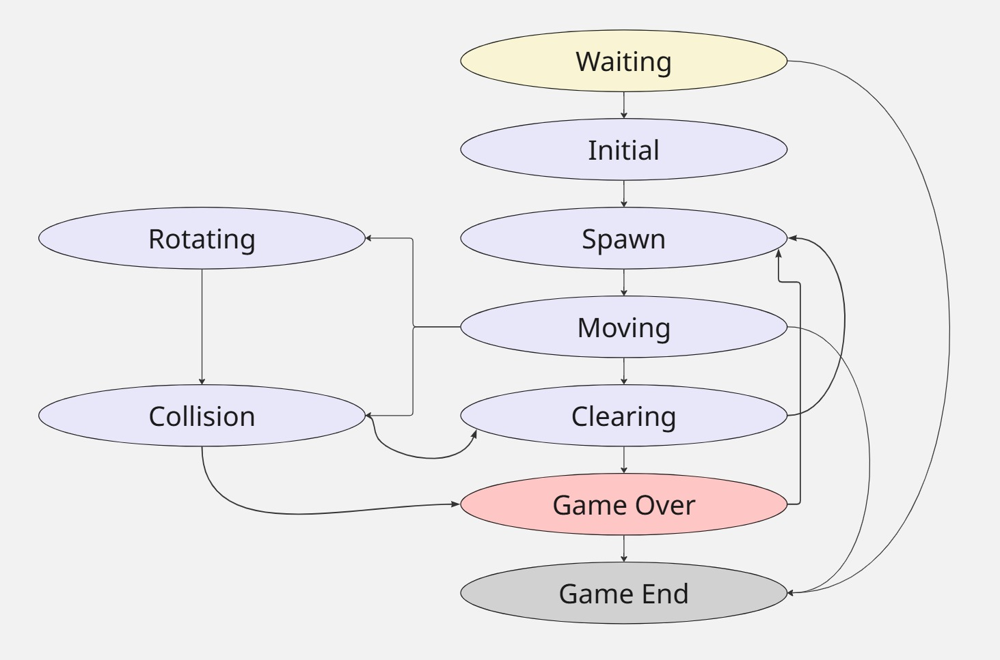

# BrickGame v1.0 (Tetris)

## Описание проекта

Данный проект представляет собой реализацию игры **Tetris (BrickGame v1.0)** на языке C (стандарт C11).

Программа разделена на:

* **библиотеку (backend)** — реализует логику игры;
* **терминальный интерфейс (frontend)** — реализован с использованием библиотеки `ncurses`.

Логика игры реализована с использованием **конечного автомата (FSM)**.

---

## Технологии

* Язык: C (C11)
* Компилятор: gcc
* Интерфейс: ncurses
* Тестирование: check
* Покрытие: gcov / lcov

---

## Структура проекта

```text
src/
├── brick_game/tetris/   # логика игры (backend)
├── gui/cli/             # терминальный интерфейс (frontend)
├── main.c
├── test.c
├── Makefile
```

---

## Архитектура

### Backend (библиотека)

Библиотека:

* обрабатывает ввод пользователя;
* хранит состояние игры;
* возвращает матрицу игрового поля;
* реализует конечный автомат.

### Frontend (CLI)

Отвечает за:

* отрисовку игрового поля;
* отображение очков, уровня и следующей фигуры;
* обработку клавиш пользователя.

---

## Реализованные механики

* Вращение фигур
* Движение влево/вправо
* Ускоренное падение
* Отображение следующей фигуры
* Удаление заполненных линий
* Завершение игры при достижении верхней границы
* Все стандартные фигуры Tetris
* Игровое поле: **10x20**

---

## Управление

| Клавиша | Действие          |
| ------- | ----------------- |
| Enter   | Начать игру       |
| P       | Пауза             |
| Q       | Выход             |
| ←       | Влево             |
| →       | Вправо            |
| ↓       | Ускорение падения |
| Space   | Вращение фигуры   |

---

## Подсчет очков

| Линий | Очки |
| ----- | ---- |
| 1     | 100  |
| 2     | 300  |
| 3     | 700  |
| 4     | 1500 |

* Рекорд сохраняется в файл
* Обновляется во время игры

---

## Уровни

* Каждые **600 очков** → уровень +1
* Максимальный уровень: **10**
* С увеличением уровня ускоряется падение фигур

---

## Тестирование

Покрытие backend реализовано с помощью библиотеки `check`.

### Запуск тестов:

```bash
make test
```

### Проверка утечек памяти:

```bash
make valgrind_test
```

---

## Покрытие кода

```bash
make gcov_report
```

Отчёт будет сгенерирован в папке `report/`.

---

##  Сборка и запуск

### Сборка и установка:

```bash
make install
```

### Запуск:

```bash
make start
```

---

##  Очистка

```bash
make clean
```

---

##  Дистрибутив

```bash
make dist
```

Создаёт архив проекта со всеми исходниками, тестами и Makefile.

---

## Конечный автомат

В проекте используется конечный автомат, описывающий состояния игры:

- Waiting
- Initial
- Spawn
- Moving 
- Rotating
- Clearing
- Collision
- GameOver
- GameEnd



---

## Соответствие требованиям

Проект:

* реализован на C11 с использованием gcc;
* разделён на backend и frontend;
* использует конечный автомат;
* покрыт unit-тестами (≥ 80%);
* соответствует структуре директорий;
* реализует все игровые механики;
* поддерживает Makefile с необходимыми целями.

---

## Автор

Maria Prokofieva
s21: kurahaar
